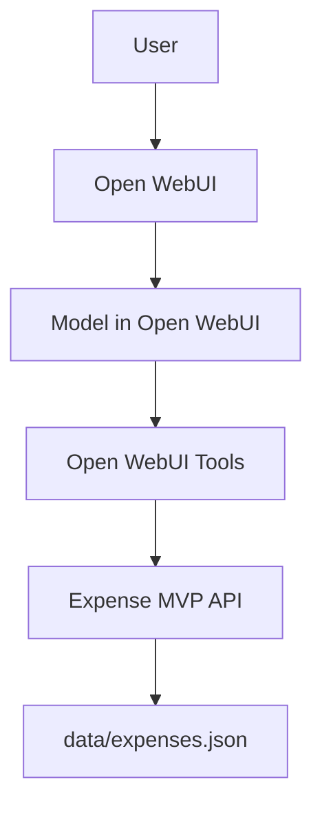

# Expense MVP API

A lightweight expense-tracking backend built with Node.js, TypeScript, and Express.

This project is now designed to be the backend service behind Open WebUI:

- Open WebUI handles chat
- Open WebUI handles model selection
- Open WebUI handles prompts and tools
- this app handles expense data, validation, and storage

## What This Backend Does

- create expenses
- update expenses
- delete expenses
- list expenses with filters
- summarize monthly spending

Expenses are stored locally in `data/expenses.json`.

## Architecture



## Setup

1. Configure `.env`

```env
PORT=4000
HOST=0.0.0.0
```

2. Start the app

```bash
npm install
npm run dev
```

Or with Docker Compose:

```bash
docker-compose up
```

The API will be available at `http://localhost:4000`.

## API

### Root

- `GET /`

Returns a small service description and endpoint map.

### Expenses

- `GET /api/expenses`
- `GET /api/expenses/:id`
- `POST /api/expenses`
- `PATCH /api/expenses/:id`
- `PUT /api/expenses/:id`
- `DELETE /api/expenses/:id`
- `GET /api/expenses/summary/monthly`

### Query Parameters for `GET /api/expenses`

- `category`
- `limit`
- `month`
- `year`
- `date_from`
- `date_to`
- `relative_day` as `today` or `yesterday`
- `days_back`

Example:

```text
GET /api/expenses?category=Food&limit=3
GET /api/expenses?relative_day=today
GET /api/expenses?days_back=7
GET /api/expenses?month=6&year=2026
```

### Create Expense

`POST /api/expenses`

```json
{
  "description": "Lunch",
  "amount": 12.5,
  "currency": "USD",
  "category": "Food",
  "notes": "team lunch",
  "date": "2026-06-17T19:30:00.000Z"
}
```

Notes:

- `amount` is in dollars in the API
- stored values are persisted in cents internally

### Update Expense

`PATCH /api/expenses/:id`

```json
{
  "amount": 15,
  "notes": "updated after tip"
}
```

### Monthly Summary

`GET /api/expenses/summary/monthly?month=6&year=2026`

Response shape:

```json
{
  "month": 6,
  "year": 2026,
  "total": 5200,
  "count": 2,
  "byCategory": {
    "Food": 1200,
    "Shopping": 4000
  }
}
```

`total` and `byCategory` values are in cents.

## Open WebUI Integration

Use Open WebUI as the AI layer and point its tools at this backend.

Suggested tool split in Open WebUI:

1. `create_expense`
   Calls `POST /api/expenses`
2. `list_expenses`
   Calls `GET /api/expenses`
3. `update_expense`
   Calls `PATCH /api/expenses/:id`
4. `delete_expense`
   Calls `DELETE /api/expenses/:id`
5. `monthly_summary`
   Calls `GET /api/expenses/summary/monthly`

There is no model configuration required in this backend anymore. Choose your model directly inside Open WebUI.

See `docs/openwebui-tools.md` for ready-to-map tool contracts.

## Persistence

The JSON DB layer is in `src/db.ts`.

It:

- creates the file if missing
- resets the store to `[]` if the file is empty or invalid

## Scripts

```bash
npm run dev
npm run build
npm start
npm test -- --run
```
