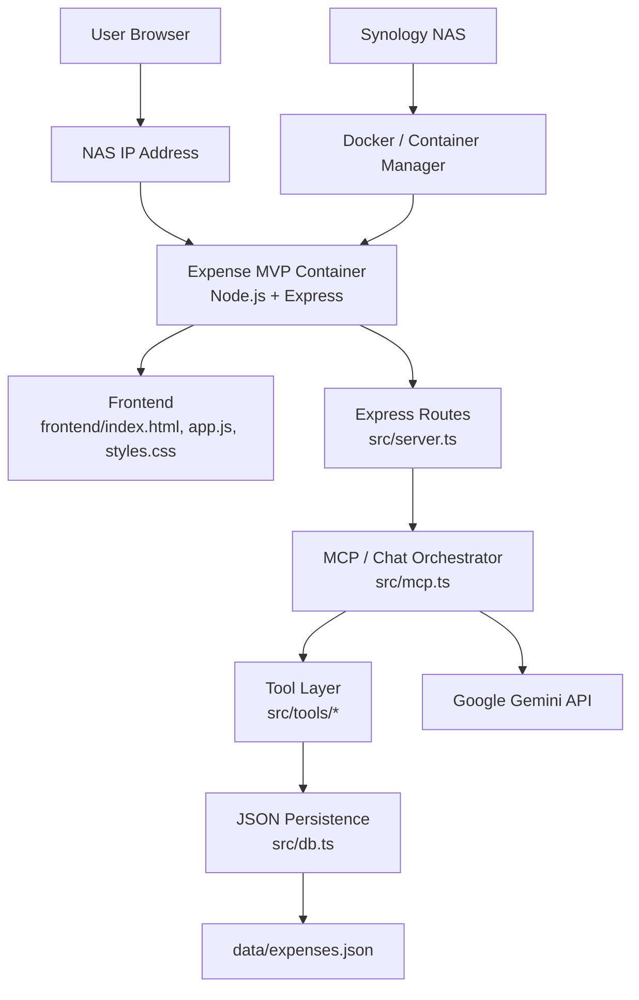
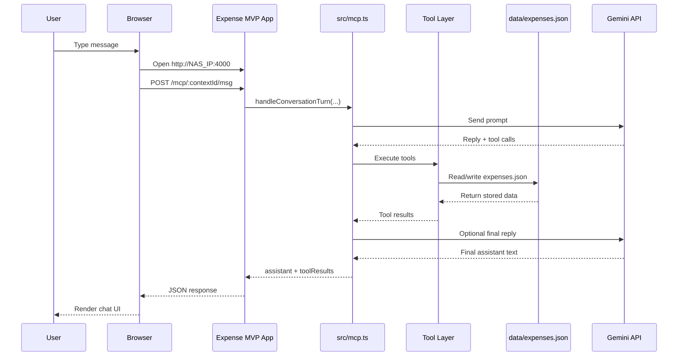

# Expense MVP

A chat-first expense tracker built with Node.js, TypeScript, and Express. The app keeps a lightweight conversation context, lets an LLM choose internal tools, stores expenses in a JSON file, and renders both chat replies and structured data results in the UI.

## What It Does

You type naturally in the chat UI. The assistant can:

- add an expense
- update an expense
- delete an expense
- list stored expenses
- summarize the current month
- ask a short follow-up question when a request is unclear

Examples:

- `I spent $12 on lunch`
- `show me my last 3 expenses`
- `how much did I spend this month?`
- `delete office expenses`
- `update my lunch expense to $15`

## Architecture

The app uses an internal MCP-style tool loop:

1. the frontend sends a chat message to `POST /mcp/:contextId/msg`
2. `src/mcp.ts` sends recent conversation plus any relevant tool context to the LLM
3. the LLM returns JSON with:
   - `reply`
   - `tool_calls`
4. the server executes those tool calls
5. the LLM can be called again to produce a final natural-language reply grounded in the tool results
6. the frontend renders:
   - the assistant reply
   - a structured result block for things like expense lists and monthly summaries

### System Diagram



### Architecture Flow



## Tools

Internal tools live in `src/tools/`:

- `src/tools/createExpense.ts`
- `src/tools/updateExpense.ts`
- `src/tools/deleteExpense.ts`
- `src/tools/listExpenses.ts`
- `src/tools/monthlySummary.ts`

Important behavior:

- `list_expenses` is capped at **4 expenses max**
- the LLM is told not to ask `list_expenses` for more than 4
- follow-up delete/update replies like `delete 2` use the previous tool result context

## LLM Providers

The app supports:

- Ollama
- Gemini

Current `.env` example:

```env
LLM_PROVIDER=ollama

GEMINI_API_KEY=your_gemini_key
GEMINI_MODEL=gemini-2.5-flash

OLLAMA_BASE_URL=http://localhost:11434
OLLAMA_MODEL=qwen2.5:3b

PORT=4000
```

Notes:

- Ollama runs locally at `http://localhost:11434`
- Gemini is called remotely through Google’s API
- `src/index.ts` only requires Gemini credentials when `LLM_PROVIDER=gemini`

## Setup

1. Install dependencies

```bash
npm install
```

2. Configure `.env`

3. If using Ollama, start it

```bash
ollama serve
```

4. Pull the model if needed

```bash
ollama pull qwen2.5:3b
```

5. Start the app

```bash
npm run dev
```

Open:

```text
http://localhost:4000
```

## Frontend

Frontend files:

- `frontend/index.html`
- `frontend/app.js`
- `frontend/styles.css`

Current UI behavior:

- press `Enter` to send
- `Shift+Enter` inserts a newline
- the composer uses a compact chat-style input with an arrow send button
- `New Expense Chat` resets the current chat context
- chat renders structured result blocks for:
  - `list_expenses`
  - `monthly_summary`
- low-quality placeholder replies like blank `1. 2. 3.` lists are suppressed in the UI when real tool results are available

## Persistence

Expenses are stored in:

- `data/expenses.json`

The JSON DB layer is in:

- `src/db.ts`

It:

- creates the file if missing
- resets the store to `[]` if the file is empty or invalid

## API

Expense REST API:

- `GET /api/expenses`
- `GET /api/expenses/:id`
- `POST /api/expenses`
- `PUT /api/expenses/:id`
- `DELETE /api/expenses/:id`

Chat endpoints:

- `POST /mcp/context`
- `POST /mcp/:contextId/msg`

The chat response includes:

- `assistant`
- `stored`
- `storeCount`
- `detectedExpense`
- `toolCalls`
- `toolResults`

## Main Files

- `src/mcp.ts`: conversation loop, tool planning, reply generation, context memory
- `src/server.ts`: Express routes
- `src/db.ts`: JSON persistence
- `src/tools/index.ts`: tool registry
- `frontend/app.js`: browser client

## Scripts

```bash
npm run dev
npm run build
npm start
npm test
```

## Tests

Tests currently cover:

- basic DB operations in `tests/expenses.test.ts`
- tool registry operations in `tests/tools.test.ts`

Run:

```bash
npm test -- --run
```

## Current Limitations

- LLM quality still affects how natural the final replies are
- Ollama model latency can be much slower than Gemini for multi-step tool flows
- there is still no dedicated automated test coverage for the full multi-turn conversation planner path in `src/mcp.ts`
